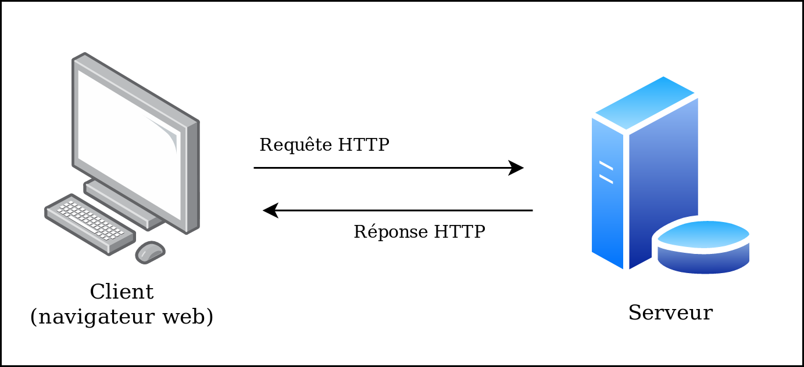

# Séance 2 - Introduction à la sécurité des applications Web (17/10/2019)

Avant de voir comment attaquer un site Web, il est impératif de comprendre dans les grandes lignes les technologies utilisées.

> On pourrait passer de nombreuses heures à parler des technologies Web (cf. cours de IF et TC), nous n'évoquerons ici que les grandes lignes de ce qu'est une application Web, en essayant de me concentrer sur les aspects utiles du point de vu de la sécurité.

## Le serveur (au sens physique du terme)

### Comprendre l'accès à un site internet

Que ce passe-t-il quand on accède à un site internet, par exemple http://example.com/ ?

-  Déjà, accéder à un site internet c'est avant tout interagir avec un autre ordinateur, eh oui n'importe quel ordinateur peut être utilisé pour héberger un site (nous verrons comment juste après) ! Dans ce cas, on appellera plutôt l'ordinateur **serveur**.
- Ce serveur est ici identifié par un **nom d'hôte** (ici *example.com*), lui-même associé à une à une **adresse IP** (ici *93.184.216.34*) servant à identifier le serveur de manière unique.
- Afin que le serveur comprenne qu'on veut accéder à une page web, nous allons communiquer avec lui via le **protocole** *HTTP* (comme dans l'URL !), à travers le **port** *80* (associé par défaut au protocole HTTP).

Mais qu'est ce que c'est au juste un protocole ?  Et un port ? 

Si on revient à la base, comment font deux ordinateurs pour communiquer ? Ils utilisent des protocoles. On peut voir les protocoles comme des langages propres aux ordinateurs, utilisés selon le type d'information qu'ils souhaitent échanger. 

En bref :


### Du protocole au service

Les protocoles sont implémentés sous la forme de **services**, c'est à dire des logiciels exécutés sur les ordinateurs et rendus accessibles (on dit aussi "exposés") sur les ports d'un ordinateur. 

> De la même manière qu'une adresse IP sert à identifier un ordinateur, un port sert à identifier un service. 

L'outil *Nmap* ([plus d'informations sur son utilisation ici](https://www.supinfo.com/articles/single/5407-utilisation-basique-nmap)) permet de trouver les ports accessibles ("ouverts") sur un serveur, et les services qui tournent sur ces mêmes ports. Par exemple :


On découvre les services *ssh* (accès à un ordinateur à distance), *smtp* (service mail) et *http* (pour les pages web).

> ipp (gestion d'imprimantes) étant *closed*, nous ne pouvons pas utiliser ce service.

Afin de bien comprendre comment est utilisé un service hébergé sur un serveur, voyons le cas de ssh. Il suffit d'utiliser un logiciel côté client capable d'utiliser "le bon vocabulaire" pour communiquer avec le service ssh, et donc se connecter au serveur via ce même protocole. Ici le logiciel client s'appelle.. `ssh` (pas très original mais efficace). Il s'utilise de la manière suivante :

```bash
jbedel@jbedel-pc:~$ ssh 192.168.1.99
```

C'est aussi simple que ça ! En tapant cette commande le serveur va demander un mot de passe et nous pourrons nous y connecter y connecter. Chaque protocole à son propre langage, et nous allons justement voir en détail un peu plus bas le cas du protocole HTTP.

Nmap est un outil très puissant, qui permettra également de découvrir les versions des services tournant sur le serveur.  Exemple :


Cela peut être utile dans la mesure ou certains services seront dans des versions obsolètes, et présentant parfois immédiatement de grosses vulnérabilités exploitables.

> Pour les plus intéressés, les vulnérabilités sont nommées et répertoriées dans un grand dictionnaire appelé [CVE](https://fr.wikipedia.org/wiki/Common_Vulnerabilities_and_Exposures) (pour Common Vulnerabilities and Exposures). Il est alors possible de chercher toutes les vulnérabilités associées à une version précise d'un service, les classer par criticité, regarder en détail de quoi il s'agit... Parfois un code d'exploitation est déjà écrit et directement utilisable via [Metasploit](https://fr.wikipedia.org/wiki/Metasploit), un framework facilitant la recherche et l'utilisation de codes d'exploitation. Comme on sort du cadre de la sécurité Web on ne s'attardera pas là dessus ici, mais pourquoi pas y consacrer une séance !

### En bref

Pour reformuler ce qui a été dit plus haut, que se passe-t-il quand on accède à une page Web ? Il s'agit d'une communication entre deux ordinateurs. On dit qu'un ordinateur **client** (le votre) va entrer en communication avec l'ordinateur **serveur** (celui sur lequel est hébergé le site) via le **protocole HTTP**. Le client va demander au serveur l'accès à une page Web, et le serveur va faire appel à un **service** pour répondre à sa demande (nous allons voir comment).

## Détaillons le protocole HTTP

### Requêtes et réponses

Pour accéder à une page web, on dit que le client va effectuer une **requête HTTP** (il va demander au serveur ce qu'il veut) et le serveur va lui envoyer en retour une **réponse HTTP**, contenant généralement la page Web en question, dans un format qu'on appel **HTML**, qui va être interpreté par le navigateur afin de l'afficher comme un humain est capable de la lire.



Voyons en détail à quoi ressemble une requête HTTP, afin de visualiser une requête HTTP, je vais utiliser un outil qu'on appel *proxy d'interception* (les plus connus sont ZAP Proxy et Burp Suite) qui va se placer entre le client et le serveur, et comme son nom l'indique intercepter les requêtes HTTP au passage et nous laisser les lire et les éditer.


> Il existe bien d'autres manières de voir les requêtes HTTP, par exemple les outils de développeurs directement présents dans Firefox, Chrome, etc.. Ils sont plus faciles à mettre en place mais je les trouve personnellement moins lisibles et pratiques que le proxy d'interception.

Essayons d'accéder à la page http://test.com/index.html : 

> Ça ne marchera pas chez vous car le site utilisé pour écrire ce cours est hébergé chez moi, mais l'idée est la même pour tous les sites !


Pour l'instant, seules les deux premières lignes vont nous intéresser

- `GET` : la méthode HTTP utilisée, ici elle correspond à la demande d'une ressource présente sur le serveur (page web, image..). Voir [la documentation](https://developer.mozilla.org/fr/docs/Web/HTTP/M%C3%A9thode) pour plus d'infos sur les autres méthodes.
- `/index.html` : l'emplacement de la ressource demandée
- `HTTP/1.1` : le protocole utilisé
- `Host: test.com` : l'hôte à qui est destiné la requête

Regardons un peu la réponse que le site envoi à notre navigateur :


Ici encore toutes les lignes ne nous intéressent pas :

- `HTTP/1.1` : le protocole utilisé
- `200 OK` : qui indique que la ressource à bien pu être accédé, voir [la documentation](https://fr.wikipedia.org/wiki/Liste_des_codes_HTTP) pour les autres codes de retour (c'est de là que vient la fameuse "erreur 404").
- `Server: Apache/2.4.41` : pas toujours présent, indique le serveur web (cette fois au sens logiciel du terme) qui va s'occuper de gérer les requêtes
- Le code HTML

Vous recevez le code HTML qui sera interprété par votre navigateur, le même qui apparaît lorsque vous utilisez le fameux "Inspecter l'élément". Une fois reçu au navigateur, voilà comment va se présenter le code HTML :


La plupart du temps, les pages HTML renvoyés à notre navigateur seront bien plus complexes. En tant que débutant, c'est normal d'être perdu face à une grosse page HTML, mais grâce à "Inspecter l'élément" (en général `Clique droit > Inspecter l'élément`) dans les navigateurs moderne, vous pourrez lire le code HTML associé à un élément précis de la page. Ne vous inquiétez pas, ça sera de plus en plus facile avec le temps, mais il n'y a pas de secret, il faut pratiquer un peu..

Un serveur web (au sens logiciel du terme) est le logiciel qui va mettre en œuvre le protocole HTTP.

Ce qui se passe, c'est qu'il y a un logiciel installé sur le serveur, dont le but va être de traiter des requêtes HTTP et d'y répondre comme il peut.

### Passer des paramètres à une page

Il est souvent utile de passer des paramètres à une requête HTTP, afin d'avoir plus d'interaction entre client et serveur, par exemple lors d'une inscription en remplissant un formulaire avec nom, prénom, etc..

Il est possible de passer des paramètres directement dans l'URL avec une requête `GET` :


De préférence, on utilisera une requête `POST`, les paramètres sont alors dans le *corps* de la requête :


## Architecture Web

Une architecture traditionnelle (même si les choses ont évolué) est LAMP.


- Linux : le système d'exploitation installé sur le serveur. Les distributions les plus communes sur serveur sont Debian, RedHat...
- Apache : il s'agit du **Serveur Web Logiciel** (à ne pas confondre avec le serveur physique), c'est ce fameux logiciel qui va s'occuper de gérer les requêtes HTTP du client et envoyer les réponses en retour. Apache est capable de renvoyer des pages en HTML et d'exécuter le code d'un langage de script comme PHP. L'alternative la plus utilisée à Apache est Nginx.
- MySQL : il s'agit d'un système de gestion de bases de données basé sur le langage SQL, c'est là où seront stockées les informations d'un client, les mots de passes, etc.. Ses alternatives les plus connues sont MariaDB et PostgreSQL.
- PHP : le langage de programmation utilisé pour les fonctionnalités à exécuter côté serveur (par exemple chercher un client dans la base de donnée et l'insérer dans une page HTML pour la renvoyer au navigateur). De nombreuses alternatives sont possibles comme Ruby, Python...


De manière synthétique, voilà comment fonctionne une architecture LAMP :


Quelques ressources pour apprendre ces différents langages :

- [learnxinyminutes](https://learnxinyminutes.com/), très (trop..) bref mais donne une idée de la syntaxe pour ne pas être perdu !
- [W3School](https://www.w3schools.com/), il s'agit de la documentation de référence, mais parfois un peu hostile aux débutants
- [Openclassroom](https://openclassrooms.com/fr/) , le site français de référence pour les cours en ligne, prend le temps d'expliquer chaque petite chose aux débutants, mais fait qu'on gagne énormément en longueur des cours qui sont au moins le quadruple de W3School..

## Les grandes catégories de failles

La [fondation OWASP](https://www.owasp.org/index.php/About_The_Open_Web_Application_Security_Project) est une association à but non lucratif dont l’objectif est « de publier des recommandations de sécurisation Web et de proposer aux internautes, administrateurs et entreprises des méthodes et outils de référence permettant de contrôler le niveau de sécurisation de ses applications Web. »

Il s'agit de la référence en matière de sécurité des application Web, leur activité est composée de différents projets collaboratifs dont l'[OWASP Top 10](https://www.owasp.org/images/7/72/OWASP_Top_10-2017_%28en%29.pdf.pdf), un condensé des failles les plus répandues du moment sur les sites Web.

Voici le dernier Top 10, explications tirées de [httpcs.com](https://httpcs.com) : 

- **A1 - Injections :** correspond au risque d’injection de commande (Système, SQL, Shellcode, ...)
- **A2 - Broken Authentification and Session Management :** correspond au risque de casser ou de contourner la gestion de  l’authentification et de la session. Comprend notamment le vol de  session ou la récupération de mots de passe.
- **A3 - Cross-Site Scripting :** correspond au XSS soit l’injection de code HTML dans une page, ce qui  provoquent des actions non désirées sur une page Web. Les failles XSS  sont particulièrement répandues parmi les failles de sécurités Web.
- **A4 - Broken Access Control :** correspond aux failles de sécurité sur les droits des utilisateurs  authentifiés. Les attaquants peuvent exploiter ces défauts pour accéder à d'autres utilisateurs.
- **A5 - Security Misconfiguration :** correspond aux failles liées à une mauvaise configuration des serveurs Web, applications, base de données ou framework.
- **A6 - Sensitive Data Exposure :** correspond aux failles de sécurité exposant des données sensibles comme les mots de passe, les numéros de carte de paiement ou encore les  données personnelles et la nécessité de chiffrer ces données.
- **A7 - Insufficient Attack Protection :** correspond à un manque de respect des bonnes pratiques de sécurité.
- **A8 - Cross-Site Request Forgery (CSRF) :** correspond aux failles liées à l’exécution de requêtes à l’insu de l’utilisateur.
- **A9 - Using Components with Known Vulnerabilities :** correspond aux failles liées à l’utilisation de composants tiers vulnérables.
- **A10 - Underprotected APIs :** correspond au manque de sécurité d'applications utilisant des API (Applications Programming Interface).   

Pour les débutants, nous conseillons de commencer par des failles traditionnelles et bien documentées telles que :

- SQL Injection (SQLi)
- Cross-site Scripting (XSS)
- Local File Injection (LFI) et Remote File Injection (RFI)

## Quelques ressources utiles

Les autres projets de l'OWASP :

- [OWASP Testing Guide (OTG)](https://www.owasp.org/index.php/OWASP_Testing_Guide_v4_Table_of_Contents) : présente un protocole de test standard et le plus exhaustif possible de la sécurité d'une application Web
- [The OWASP Vulnerable Web Applications Directory Project (VWAD)](https://www.owasp.org/index.php/OWASP_Vulnerable_Web_Applications_Directory_Project) : répertoire de sites/machines virtuelles vulnérables pour s'entraîner, dont plusieurs créés directement par l'OWASP comme les très bons Damn Vulnerable Web App et Juice Shop
- Bien d'autres encore, à découvrir sur le site de l'OWASP..

Pour s'entraîner :

- [Hacksplaining](https://www.hacksplaining.com/lessons) : un super site pour apprendre en pratiquant, pas de grosse doc à lire, tout est intéractif et bien expliqué, foncez y les yeux fermé !
- [RootMe](https://www.root-me.org/) : la référence (et francophone en plus) en matière d'entraînement à la sécurité, plein de challenges avec de la documentation, un forum pour s'entraider, la possibilité de lancer des machines virtuelles à attaquer directement sur leurs serveurs.. bref la perfection pour tout débutant en apprentissage de la sécurité informatique !
- [HackThisSite](https://www.hackthissite.org/)
- Les machines virtuelles de [la série LAMP CTF](https://www.vulnhub.com/series/lampsecurity,43/)
- L'application Web [Damn Vulnerable Web App (dvwa)](https://github.com/ethicalhack3r/DVWA)

Outils :

- Nmap
- ZAP Proxy / Burp Proxy
- sqlmap / sqlninja
- Dirbuster / dirsearch
