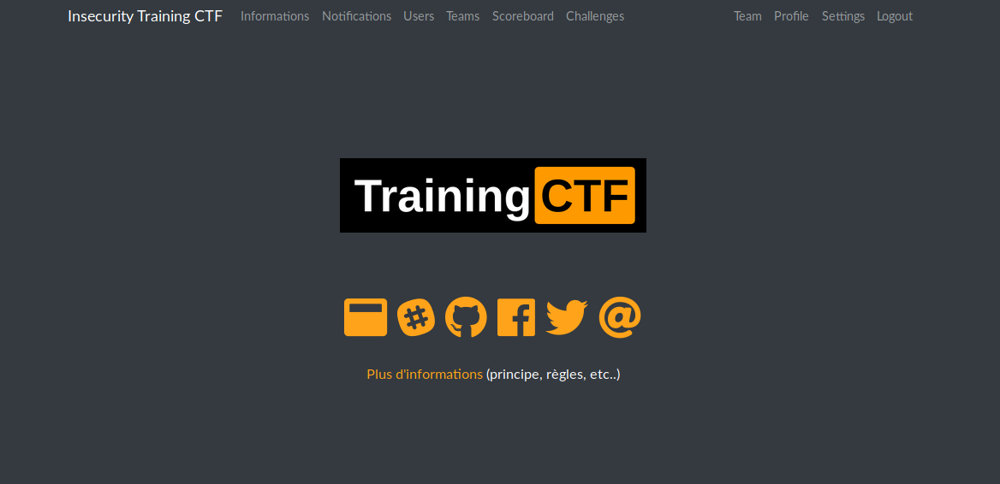
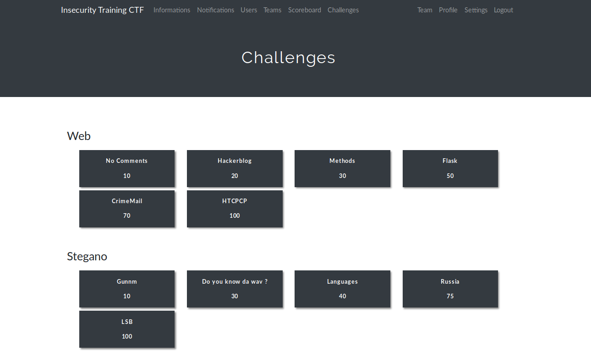

# Séance 1 - Présentation générale de l'association, Training-CTF (10/10/2019)

## Résumé de la séance

Une présentation de l'association et du bureau à été faite par Sylvain, le président d'InSecurity, puis nous sommes rapidement passés à la pratique avec un premier  entraînement par petites équipes (généralement de 2 à 4 personnes), merci d'être venus si nombreux !

## Training CTF

Un Capture The Flag (abrégé en CTF)  désigne une compétition de hacking éthique. Il en existe plusieurs  catégories, l'une des plus connues et plus populaires étant les CTF  Jeopardy. Du même nom que le célèbre jeu télévisé, un CTF Jeopardy  consiste en une série d'épreuves, classées par thèmes et ancrées dans le  vaste domaine de la sécurité informatique.

Cryptographie, sécurité Web, forensics,  sécurité réseau, stéganographie, logique, programmation,  reverse-engineering... il y en a pour tous les goûts et pour tous les  niveaux ! Le but du jeu est de résoudre le plus de challenges possible,  individuellement ou par équipes. Plus une épreuve est compliquée, plus  sa résolution rapporte de points.

Nous avons mis en place pour cette première séance un CTF débutant permettant aux membres de découvrir les différentes catégories de challenges qu'ils pourront rencontrer au cours de l'année. Nous avons été surpris par le niveau des membres qui, bien que pour la plupart n'ayant encore reçu aucun cours de sécurité, on réussi à résoudre de nombreux challenges !

Quelques captures d'écrans de la plateforme: 

## Ressources utiles

- [Diaporama de présentation de l'asso](https://docs.google.com/presentation/d/1GtapevyiLQRp6rlE5IWyUgwXyibm-izpjZVabtZ1qOw/edit?usp=sharing)
- [Training CTF sur lequel les membres se sont entraînés](https://training-ctf.insecurity-insa.fr/) 

